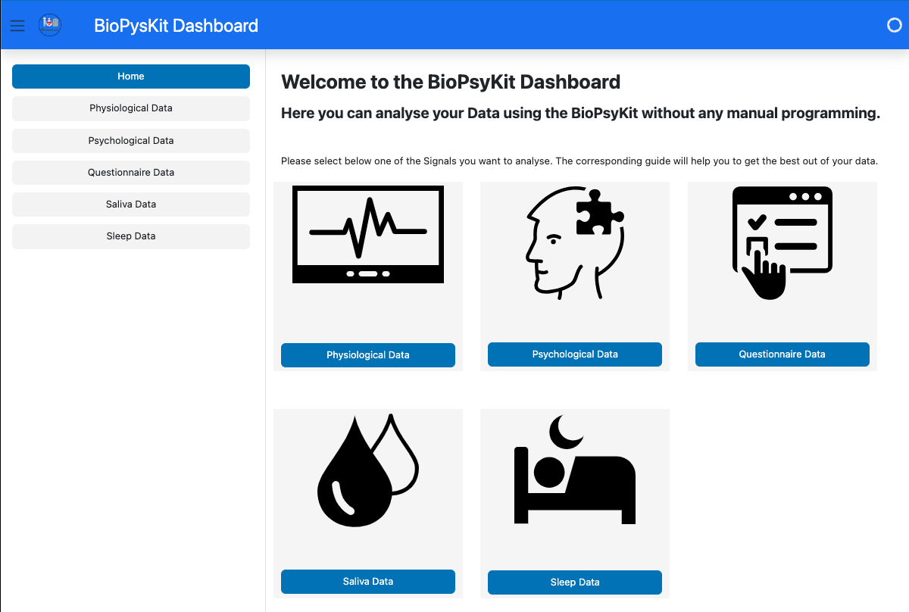

# BioPsyKit Dashboard


[](https://github.com/psf/black)
[](https://github.com/mad-lab-fau/biopsykit-dashboard/actions/workflows/test_build_and_deploy.yml)

## Table of contents
* [General info](#general-info)
* [Setup for local development](#Setup-for-local-development)
* [Convert to pyodide](#convert-to-pyodide)


## General info
This project is a Dashboard version of the [Biopsykit](https://github.com/mad-lab-fau/BioPsyKit) Python package. 
This enables researchers to use this package without programming themselves but perform their analyses in the 
browser instead of a Python IDE. 

The Dashboard is built with [Panel](https://panel.holoviz.org) and [HoloViz](https://holoviz.org) and is with that
converted into WASM (Web Assembly) via [pyodide](https://pyodide.org/en/stable/#) and can be run in the browser without 
sending files to a dedicated server.



## Setup for local development
In order to contribute to this project, you need to have Python 3.10  and [poetry](https://python-poetry.org) installed. 
Then run the commands below to get the latest source and install the dependencies:

```bash
git clone https://github.com/mad-lab-fau/biopsykit-dashboard.git
cd biopsykit-dashboard
poetry install
```

To then run the Dashboard locally in your Browser:

```bash
poetry run poe run_local
```

after that the Dashboard should start in your default Browser.

## Convert to pyodide
You can also convert the application to a pyodide application. This will create a combination of html and javascript
Files that can be run in the browser without a server. To do this you can use the following command:

```bash
poetry run poe build_pipelines
```

This will build all the pipelines into one application. If you want to build them individually you can use the following
command:

```bash
poetry run poe convert_files
```

Here you can specify the pipelines you want to convert.


